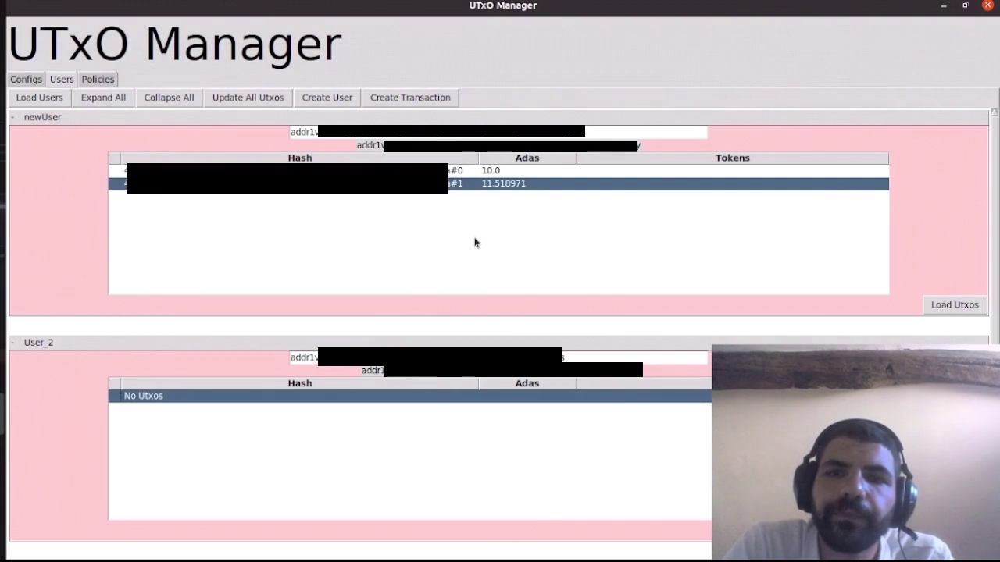
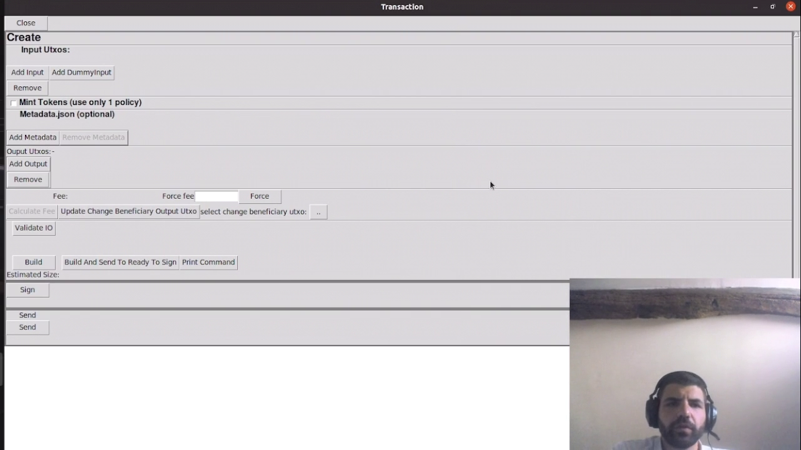
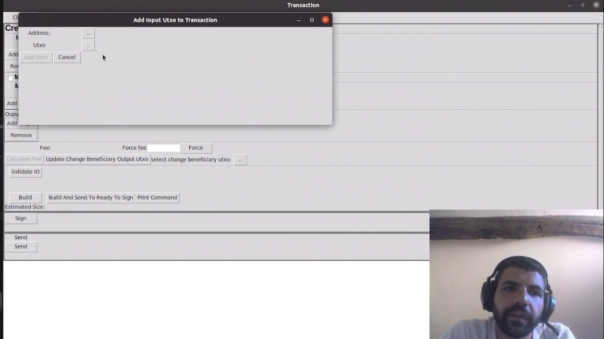
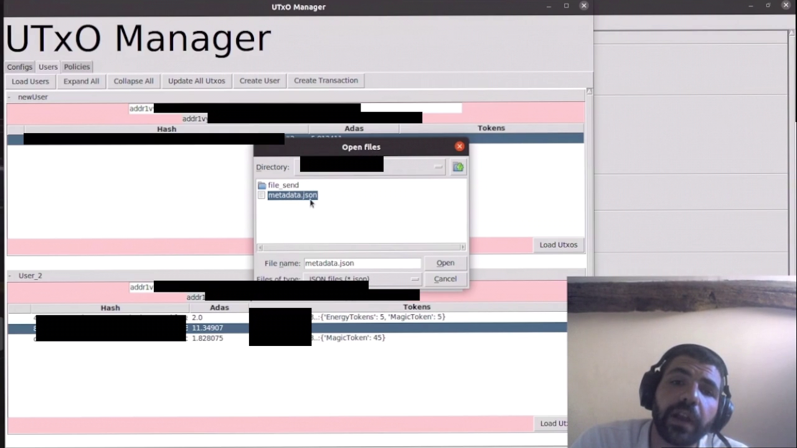
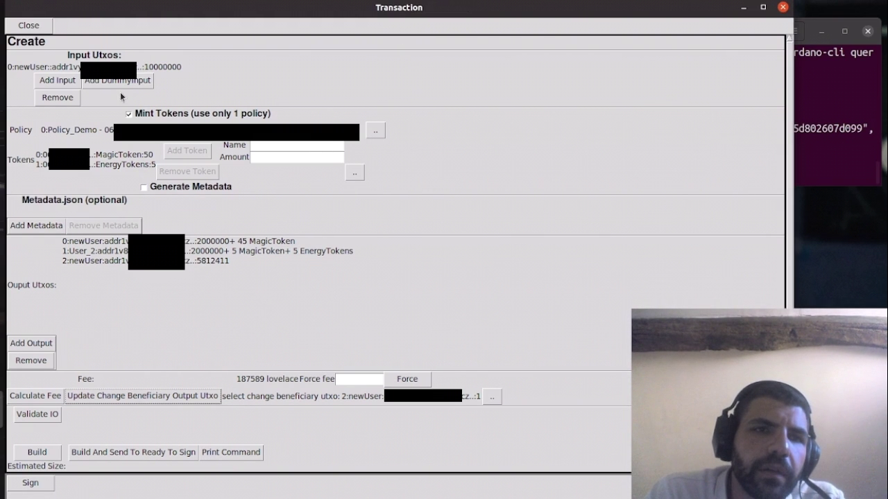

# Cardano UTxO Manager


Graphical interface for the `cardano-cli` that allows the user to create users, create minting policies

# Features
- Create Users
- Visualize UTxOs of users
- Create Policies
- Visualize policies
- Create Transactions
  - Send funds 

# Installation
With python3 install the following dependencies, the usage of a venv is recommended.
```
sudo apt install python3-pip
sudo apt-get install python3-tk
pip3 install tabulate
```

# Demo
https://youtu.be/oMUDvHCbzKo

# Usage

You need to have a cardano-node running and cardano-cli installed in your machine.

The code was only tested in Ubuntu.

Run `python3 main.py`.

Configure your paths in the `Configs` tab.

Create folder `utxo_manager/data/_users`, try to create a user and check the logs in the terminal to see if there are errors.

If success, try loading the Utxos for that user. If you add funds to that user, you can start creating transactions with the buttom `Create Transaction`.

If you create a new policy, you can start minting native tokens.

If you want to import a user or a policy, create a dummy user or policy and replicate the corresponding file and folder structure in `utxo_manager/data/_users` or `utxo_manager/data/_policies` and do `Load Users` or `Load Policies` in the UI.

= Intensions and perspectives

This software is not intended to replace the functionnalities of a wallet for an end user.

It can be used  to have fine control of utxos (the control that we can have with `cardano-cli`, but with highly improved user experience (or let's say alternative UX to cli, so we don't open a debate)) or for educationnal purposes.

With some extensions, a tool centered on the UTxO management can be very useful as a debuger for Cardano Smart Contracts developpers, although there is some design, user needs analysis and development to do if that direction is taken. 

# More Screenshots






